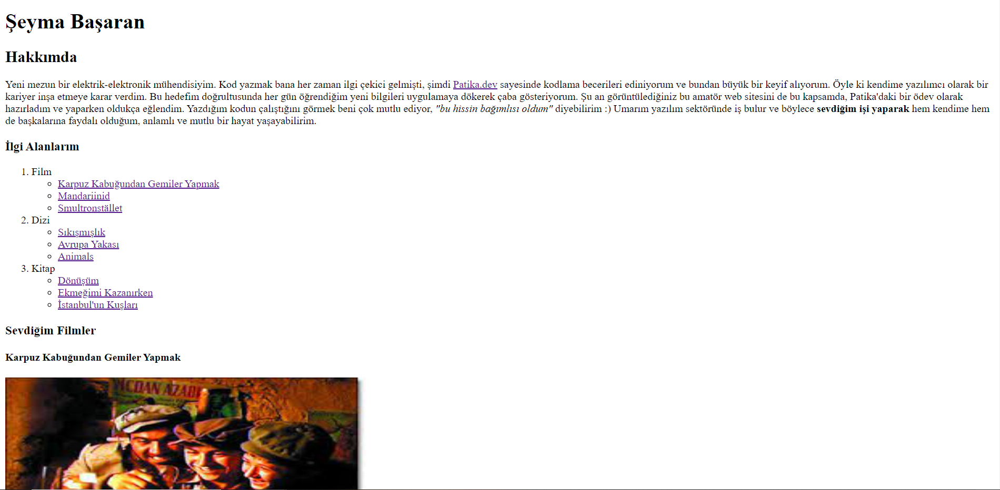

# HTML Dersinin İkinci Ödevi

Bu ödevdeki görevimiz, Patika.dev'in HTML dersindeki ilk ödevin ([benim ilk HTML ödevime buradan ulaşabilirsiniz](https://github.com/basaranseyma/HTML_Odev1)) daha fazla özellik eklenerek geliştirilmiş bir versiyonunu hazırlarken öğrendiğimiz yeni bilgileri kullanmak. 

Peki, nedir bu yeni özellikler? 

* Sayfaya bir adet **resim eklenmesi** ve bu resme bir **açıklama** yazılması
* Sevilen film, dizi ve kitapları bunlar başlıklar olacak şekilde sıralamak *(Film, dizi, kitap sıralı liste; içerikleri bullet liste olacak şekilde)*
* Bunları sıralarken film ve dizilerin en az bir tanesine **IMDb linki**, kitapların bir tanesine de **Goodreads linki** yazmak
* Kurulan yapılarda `block`, `inline` gibi elementler kullanmaya çalışmak

Projenin görünümü: 

## Kurulum

Bu projeyi çalıştırmak için özel bir kurulum gerekmez. Sadece "index.html" dosyasını herhangi bir web tarayıcısıyla açarak sayfayı görüntüleyebilirsiniz.

## Lisans

Bu proje, [MIT Lisansı](https://choosealicense.com/licenses/mit/) altında lisanslanmıştır. Daha fazla bilgi için "LICENSE" dosyasını inceleyebilirsiniz.
