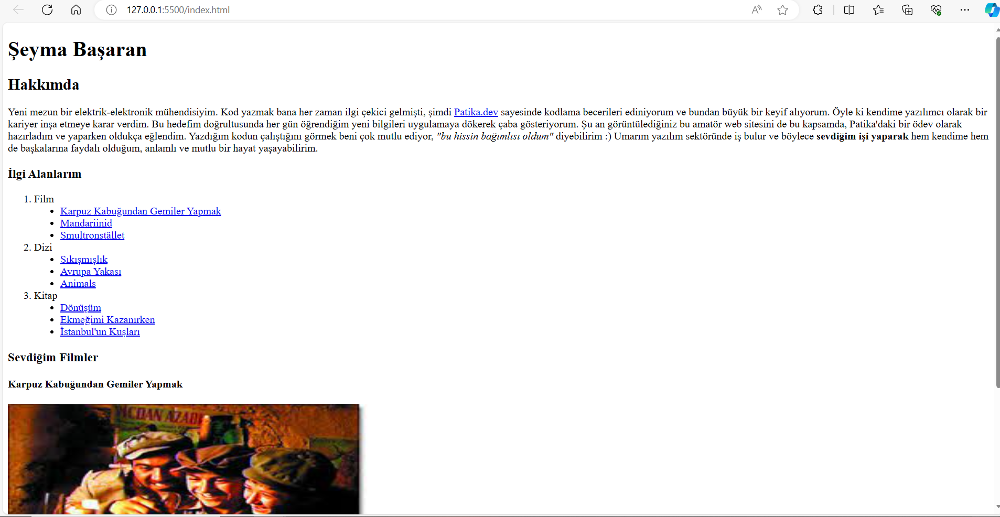

# Second Assignment for HTML Course

In this assignment, our task is to create an improved version of the first assignment in Patika.dev's HTML course ([you can access my first HTML assignment here](https://github.com/basaranseyma/HTML_Odev1)) by utilizing the new knowledge we have acquired.

So, what are these new features?

* Adding one **image** to the page and providing a **caption** for this image
* Listing favorite movies, TV series, and books as headings *(Movies, TV Series, Books as ordered lists; their contents as unordered lists)*
* While listing them, adding an **IMDb link** to at least one of the movies or TV series, and a **Goodreads link** to one of the books
* Trying to use elements like `block`, `inline` 

Project preview: 

## Installation

No special installation is required to run this project. You can simply open the "index.html" file with any web browser to view the page.

## Licence

This project is licensed under the [MIT Licence](https://choosealicense.com/licenses/mit/.). You can review the "LICENSE" file for more information.
